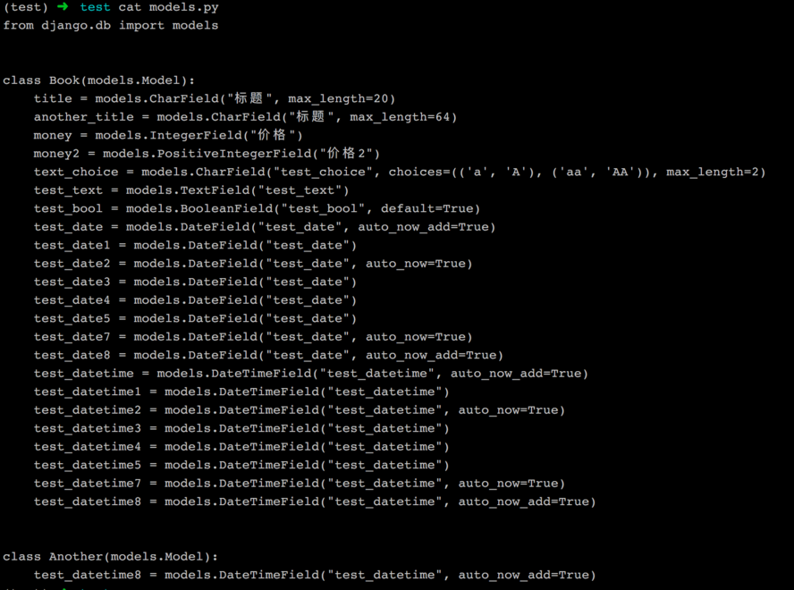

# rfw_utils

本库的目的在于根据一个给定的 json，快速生成一个 RESTful 的后台接口，但是不关心具体的业务逻辑，需要你在生成的接口上添加其他的逻辑。生成的代码可作为脚手架或者快速原型的工具。


## 截图如下

依据 test.json 生成的 models.py



依据 test.json 的接口生成的 API 接口


## 安装 & 使用

* ```git clone git@github.com:h3l/rfw_utils.git```

* 切换到你所处的虚拟环境

* python setup.py install 直接安装

* 在 Django 的 setting.py 的 INSTALLED_APPS 中添加 "rfw_utils"

* ```python manage.py startapp_skeleton XXX.json```(XXX.json 为配置文件，例子可见代码库中的test.json)

* 将上一步中的 XXX 加入INSTALLED_APPS 中，在 urls 中添加新 app 的urls，即完成了快速构建的过程

  ​

## 小彩蛋

raw_utils.functions 下的 generate_fields 非常好用，可以看看生成的 serializers.py 中的用法。

## TODO

鉴于 Django admin 的二次开发成本很高，可以依据 json 配置文件生成相应的前端代码，方便快速开发。

